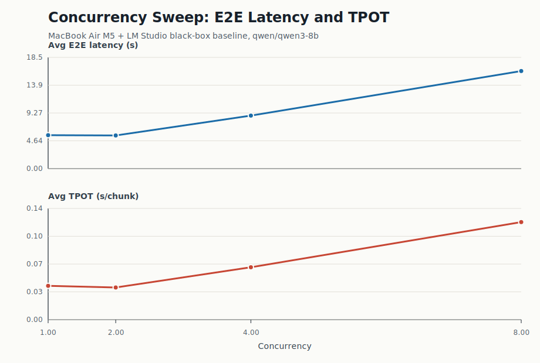
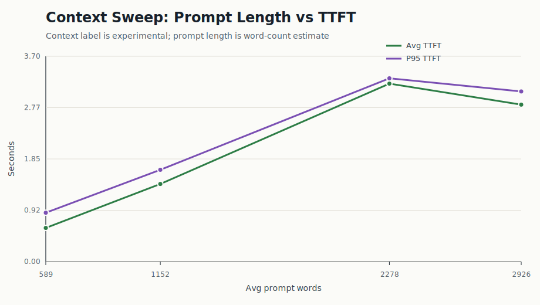
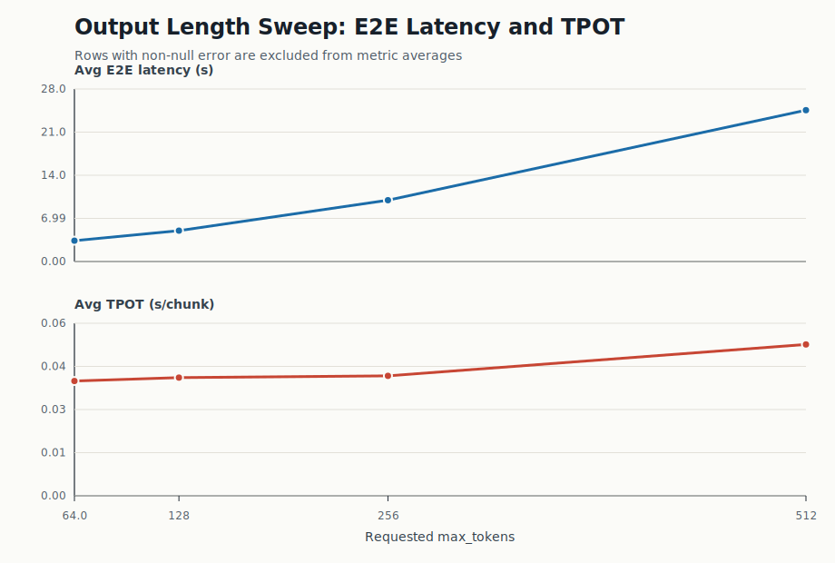

# Local Serving Baseline

This document summarizes the MacBook Air M5 + LM Studio black-box serving
baseline. It is the first layer of the project, used to build serving-metric
intuition before moving into the white-box scheduler and KV cache lab.

## Scope

This baseline measures a local OpenAI-compatible streaming endpoint:

```text
POST http://127.0.0.1:1234/v1/chat/completions
```

The baseline answers three practical questions:

1. What happens to latency when concurrency increases?
2. What happens to TTFT when prompt length increases?
3. What happens to E2E latency and TPOT when output length increases?

This baseline does not claim vLLM performance. It is a local serving
measurement scaffold.

## Environment

| Item | Value |
|---|---|
| Machine | MacBook Air M5 |
| Serving runtime | LM Studio / local OpenAI-compatible API |
| Model | `qwen/qwen3-8b` |
| API mode | streaming chat completions |
| Client | Python stdlib `urllib.request` |
| Proxy behavior | localhost requests bypass system HTTP proxies |

The client records:

- request arrival time
- first streamed content chunk time
- finish time
- output chunk count
- TTFT
- TPOT
- E2E latency
- chunks/s
- error string

Important caveat: `output_tokens` currently means non-empty streaming chunks.
It is useful for timing analysis, but it is not tokenizer-accurate yet.

## Commands

Day 2 concurrency sweep:

```bash
python3 -m local_serving_baseline.run_concurrency_sweep \
  --levels 1 2 4 8 \
  --requests-per-level 10 \
  --max-tokens 128 \
  --output-prefix concurrency_sweep_day2
```

Day 3 context sweep:

```bash
python3 -m local_serving_baseline.run_context_sweep \
  --lengths 1024 2048 4096 8192 \
  --requests-per-length 5 \
  --max-tokens 64 \
  --output-prefix context_sweep_day3
```

Day 4 output length sweep:

```bash
python3 -m local_serving_baseline.run_output_len_sweep \
  --lengths 64 128 256 512 \
  --requests-per-length 5 \
  --output-prefix output_len_sweep_day4
```

Generate local baseline figures:

```bash
python3 analysis/plot_local_baseline.py
```

## Figures

The SVG figures are generated from the raw JSONL result files using
`analysis/plot_local_baseline.py`.







## Experiment 1: Concurrency Sweep

Raw results:

- `local_serving_baseline/results/concurrency_sweep_day2.jsonl`
- `local_serving_baseline/results/concurrency_sweep_day2_summary.md`

| Concurrency | Requests | Errors | Avg TTFT (s) | P95 TTFT (s) | P99 TTFT (s) | Avg E2E (s) | P95 E2E (s) | Avg TPOT (s) | Avg chunks/s |
|---:|---:|---:|---:|---:|---:|---:|---:|---:|---:|
| 1 | 10 | 0 | 0.4336 | 0.7340 | 0.9498 | 5.5741 | 6.0311 | 0.0414 | 24.2240 |
| 2 | 10 | 0 | 0.6253 | 0.8706 | 0.9036 | 5.5265 | 5.7884 | 0.0393 | 25.4310 |
| 4 | 10 | 0 | 0.9635 | 1.4425 | 1.4676 | 8.8363 | 9.8870 | 0.0641 | 16.2080 |
| 8 | 10 | 0 | 1.5414 | 2.4780 | 2.5364 | 16.2634 | 19.2307 | 0.1192 | 10.0250 |

Interpretation:

- Concurrency 1 and 2 behave similarly in E2E latency.
- Concurrency 4 shows a clear E2E and TPOT increase.
- Concurrency 8 significantly worsens E2E latency and chunk-level TPOT.
- This is a local serving saturation signal, not a production vLLM benchmark.

Interview-safe wording:

> In the MacBook Air M5 + LM Studio baseline, higher concurrency exposed serving
> pressure: E2E latency rose from about 5.57 s at concurrency 1 to about 16.26 s
> at concurrency 8, while chunk-level TPOT rose from about 0.041 s to about
> 0.119 s.

## Experiment 2: Context Sweep

Raw results:

- `local_serving_baseline/results/context_sweep_day3.jsonl`
- `local_serving_baseline/results/context_sweep_day3_summary.md`

| Context label | Requests | Errors | Avg prompt words | Avg TTFT (s) | P95 TTFT (s) | Avg E2E (s) | P95 E2E (s) | Avg TPOT (s) |
|---:|---:|---:|---:|---:|---:|---:|---:|---:|
| 1024 | 5 | 0 | 589 | 0.6065 | 0.8801 | 2.9939 | 3.2553 | 0.0398 |
| 2048 | 5 | 0 | 1152 | 1.3980 | 1.6532 | 3.8541 | 4.1369 | 0.0405 |
| 4096 | 5 | 0 | 2278 | 3.2048 | 3.3010 | 5.8204 | 6.0234 | 0.0430 |
| 8192 | 5 | 0 | 2926 | 2.8267 | 3.0642 | 5.7251 | 6.2098 | 0.0480 |

Interpretation:

- TTFT rises clearly from the 1024 label to the 4096 label.
- The 8192 row must be interpreted carefully: prompt words were capped at about
  2926 to avoid exceeding the loaded LM Studio context window.
- The original 8192 probe with about 3712 words failed because tokenizer-expanded
  prompt length exceeded the context window.

Interview-safe wording:

> The context sweep taught me two things. First, longer prompts increase prefill
> pressure and TTFT in the local black-box baseline. Second, benchmark prompt
> length must be handled carefully: word count, configured context label, and
> actual tokenizer length are not the same.

## Experiment 3: Output Length Sweep

Raw results:

- `local_serving_baseline/results/output_len_sweep_day4.jsonl`
- `local_serving_baseline/results/output_len_sweep_day4_summary.md`

Rows with non-null `error` are counted in the Errors column but excluded from
latency and throughput averages.

| Max tokens | Requests | Errors | Avg TTFT (s) | Avg E2E (s) | P95 E2E (s) | Avg TPOT (s) | P95 TPOT (s) | Avg chunks/s | Avg output chunks |
|---:|---:|---:|---:|---:|---:|---:|---:|---:|---:|
| 64 | 5 | 1 | 1.2058 | 3.3796 | 5.1433 | 0.0367 | 0.0376 | 27.2725 | 60.2500 |
| 128 | 5 | 0 | 0.3582 | 5.0058 | 5.1101 | 0.0378 | 0.0383 | 26.4680 | 124.0000 |
| 256 | 5 | 0 | 0.3585 | 9.9449 | 10.0601 | 0.0383 | 0.0386 | 26.0800 | 251.0000 |
| 512 | 5 | 0 | 0.3511 | 24.5394 | 28.7197 | 0.0484 | 0.0566 | 21.1320 | 500.6000 |

Interpretation:

- The long-output prompt successfully pushed output chunks close to the requested
  `max_tokens` cap.
- TTFT remains relatively stable from 128 to 512.
- E2E latency grows as output length grows.
- The 512 setting shows worse TPOT and lower chunks/s, suggesting decode-phase
  pressure in the local serving stack.

Interview-safe wording:

> The output sweep supports the prefill/decode mental model: when the prompt is
> fixed and requested output length grows, TTFT is mostly stable, while E2E
> latency grows because decode runs for more steps.

## What This Baseline Supports

Safe claims:

- The project has a real streaming benchmark client.
- The client can collect TTFT, TPOT, E2E latency, tail latency, chunks/s, and
  error records.
- The Mac baseline shows concurrency pressure, context/prefill pressure, and
  output/decode pressure.
- The local results help define the metrics used later in the scheduler lab.

Unsafe claims:

- This is not a vLLM benchmark.
- This does not prove GPU kernel performance.
- This does not validate vLLM PagedAttention behavior.
- This does not prove production-serving capacity.
- `output_tokens` is not tokenizer-accurate yet.

## Next Improvements

- Add tokenizer-based prompt and output token counting.
- Add README-level summary figures and concise result bullets.
- Add a repeatable environment note for LM Studio context length and parallelism.
- Use the same metric definitions in the scheduler simulator.
